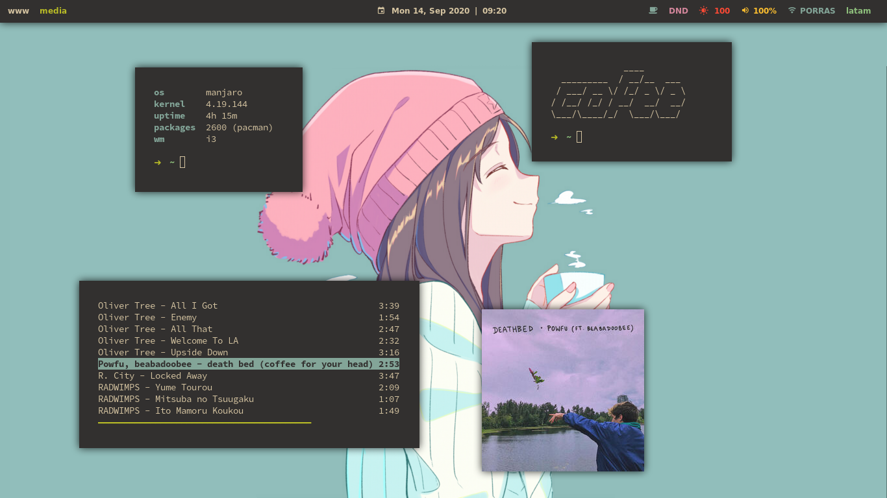

# coffee gruvbox i3 | dotfiles 
messy configuration files of an unemployed Linux lover

# dependencies: 
* [betterlockscreen](https://github.com/pavanjadhaw/betterlockscreen) for the autolock script (But you can edit the script to use your own screen locker)
* [mpd](https://github.com/MusicPlayerDaemon/MPD) & [mpc](https://github.com/MusicPlayerDaemon/mpc) for the tmux tmux-mpd script (But if you have ncmpcpp you'll obviously have them)
* [tpm](https://github.com/tmux-plugins/tpm) for tmux plugins 
* [kunst](https://github.com/sdushantha/kunst) & [sxiv](https://github.com/muennich/sxiv) for Mpd cover 
* the scripts needed are in "./scripts"

# installation:
idk, install them yourself, I'm to lazy for that ❤ 
