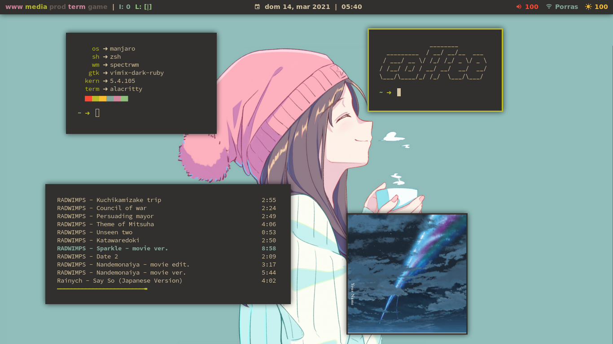

# coffee ☕ gruvbox i3/spectrwm | dotfiles 
messy configuration files of an unemployed Linux lover

# i3:


# spectrwm:


    No "death bed" because I lost all my music :(

# dependencies: 
* [GNU Stow](https://gnu.org/software/stow)
* [betterlockscreen](https://github.com/pavanjadhaw/betterlockscreen) for the autolock script (But you can edit the script to use your own screen locker)
* [mpd](https://github.com/MusicPlayerDaemon/MPD) & [mpc](https://github.com/MusicPlayerDaemon/mpc) for the tmux tmux-mpd script (But if you have ncmpcpp you'll obviously have them)
* [kunst](https://github.com/sdushantha/kunst) & [sxiv](https://github.com/muennich/sxiv) for Mpd cover
* [tpm](https://github.com/tmux-plugins/tpm) for tmux plugins  (included as a submodule)
* the scripts needed are in [scripts](scripts/.scripts)
* the colorscheme (located in [alacritty](alacritty/.config/alacritty/)) may be achieved with ```wal --theme <path_to_the_json_colorscheme>```

# installation for i3:
1. Clone the repo
    ```bash
    git clone https://github.com/TWB0109/PDots.git --recursive
    ```
  
2. Install GNU Stow
  * Arch Linux and derivatives
    ```bash
    pacman -S stow
    ```
    
  * Ubuntu and derivatives
    ```bash
    apt-get install stow
    ```
    
3. Backup all the files that you don't want to lose (e.g your .vimrc, .xresources, .tmux.conf, .config/i3/config, .config/polybar/config, etc.)
 
4. Delete the files in your home directory that you want to stow
 
5. Stow the repo (Bash and Zsh, don't know about Fish)
   ```bash
   cd PDots
   stow alacritty i3 lf ncmpcpp picom polybar scripts tmux vim xresources
    ```

# installation for spectrwm:
1. Clone the repo
    ```bash
    git clone https://github.com/TWB0109/PDots.git --recursive
    ```
  
2. Install GNU Stow
  * Arch Linux and derivatives
    ```bash
    pacman -S stow
    ```
    
  * Ubuntu and derivatives
    ```bash
    apt-get install stow
    ```
    
3. Backup all the files that you don't want to lose (e.g your .vimrc, .xresources, .tmux.conf, .config/spectrwm/spectrwmrc, etc.)
 
4. Delete the files in your home directory that you want to stow
 
5. Stow the repo
   ```bash
   cd PDots
   stow alacritty spectrwm lf ncmpcpp picom scripts tmux vim xresources
    ```

# notes:
GNU stow will symlink the files in the repo to the respective files in your system
